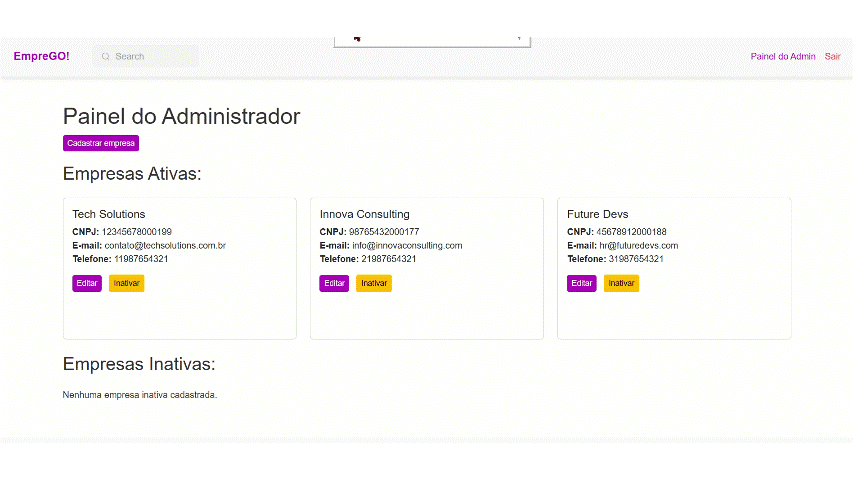
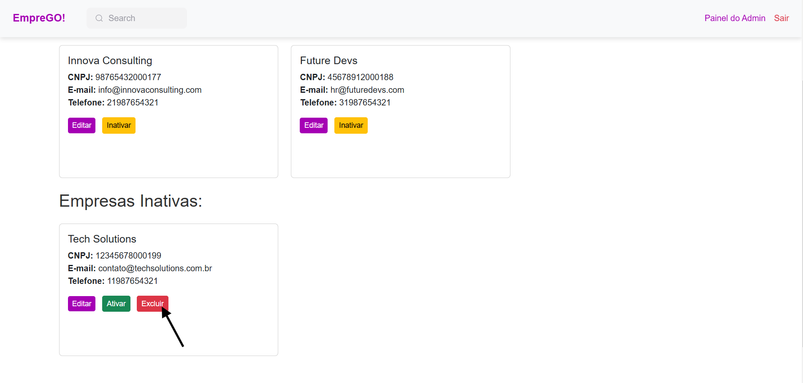
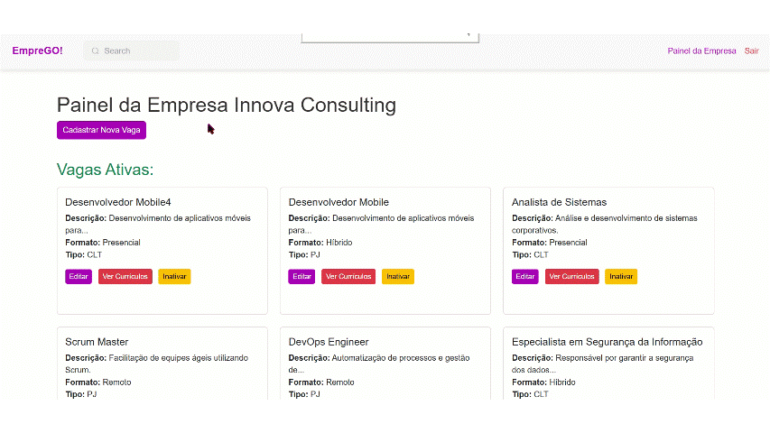

### Curso Técnico de Desenvolvimento de Sistemas - Senai Itapeva
## Status
Projeto concluído!

# EmpreGO

.png)

## Descrição:
O projeto possui o objetivo de conectar empresas e candidatos permitindo a divulgação de vagas e a busca de oportunidades de emprego. A aplicação conta com funcionalidades específicas para usuários administradores, empresas e visitantes. Ele é composto por um sistema de autenticação, uma interface para administradores e empresas, além de funcionalidades para visualização e candidatura a vagas.

# índice 
* [Status](#status)
* [Funcionalidades](#funcionalidades)
* [Tecnologias](#tecnologias-utilizadas)
* [Autores](#autores)
* [Pré-Requisitos](#pré-requisitos)
* [Instalação e Configuração](#instalação-e-configuração)
* [Licença](#licença)

## Funcionalidades
**Autenticação de Usuário:**
- Login para administradores e empresas.
  
  **Login(ADM):**
  

  **Login(Empresas):**
  

- Sessões seguras utilizando Flask-Session.
- Busca de Vagas: Permite buscar vagas por palavras-chave no título ou descrição.

    **Buscar Vagas:**
    

- Candidatura a Vagas: Usuários podem se candidatar ás vagas enviando o seu currículo (PDF).

    **Candidatura:**
    

**Gerenciamento de Empresas (Admin):**
- Cadastro, edição, ativação/desativação e exclusão de empresas.

    **Cadastro:**
    

    **Edição:**
    

    **Ativação/Desativação:**
    

    **Exclusão:**
    

**Gerenciamento de Vagas (Empresa):**
- Cadastro, edição, ativação/desativação e exclusão de vagas.

    **Cadastro:**
    
    
    **Edição:**
    

    **Ativação/Desativação:**
    

    **Exclusão:**
    

**Candidaturas:**
- Envio de currículos em formato PDF para vagas ativas.

**Visualização Pública:**
- Página inicial com listagem de vagas ativas e detalhes das vagas.

## Tecnologias Utilizadas
**Linguagem/Frameworks:**
- 
- 
- 
- 
- 
- 
- 

## Pré-requisitos
**Certifique-se de ter as seguintes ferramentas instaladas antes de executar o projeto:**

- Python 3.x
- Pip (gerenciador de pacotes do Python)

## Instalação e Configuração
**1 - Instalar Python 3.x**
- Acesse o site oficial do Python: https://www.python.org/downloads/.
- Faça o download da versão mais recente do Python 3.x para o seu sistema operacional (Windows, macOS ou Linux).
- Durante a instalação, marque a opção "Add Python to PATH" para facilitar o uso do Python no terminal.

**2 - Instalar o Pip (Gerenciador de Pacotes do Python)**
- O Pip geralmente é instalado automaticamente com o Python. Para confirmar, execute o seguinte comando no terminal:
 --bash-- **pip --version**  
- Se o Pip não estiver instalado, siga as instruções na documentação oficial do Pip.

**3 - Instalar o Git**
- Faça o download e instale o Git: https://git-scm.com/.
- Após a instalação, verifique se está funcionando com o comando:
 bash **git --version**

**4 - Instalar as Dependências Necessárias Individualmente**
- Execute os seguintes comandos no terminal para instalar cada biblioteca necessária:

- Flask (Framework Web):
bash **pip install flask** 

- E após o comando acima insira a seguir o seguinte comando para estabelecer conexão com o banco de dados: bash **pip install mysql-connector-python**

**5 - Executar o Projeto**
- Certifique-se de estar na pasta do projeto.
- Inicie o servidor Flask no terminal:
  bash
  **python app.py**  
- Abra um navegador e acesse:
  http://127.0.0.1:5000

## Autores
- Yasmim Bueno de Morais - GitHub - https://github.com/YMorais/

## Licença
Este projeto está licenciado sob a Licença MIT - veja o arquivo LICENSE para mais detalhes.